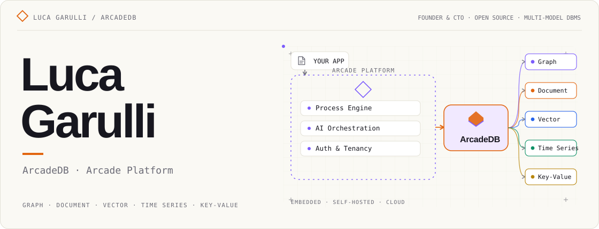

<!-- GitHub profile README. Upload this file AND the assets/ folder to the repository root (repo name must match your GitHub username, e.g. lvca/lvca). -->

<picture>
  <source media="(max-width: 640px) and (prefers-color-scheme: dark)" srcset="assets/header-mobile-dark.svg" />
  <source media="(max-width: 640px) and (prefers-color-scheme: light)" srcset="assets/header-mobile-light.svg" />
  <source media="(prefers-color-scheme: dark)" srcset="assets/header-dark.svg" />
  
</picture>
